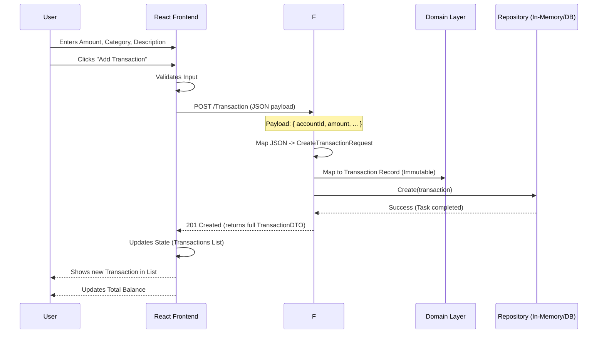
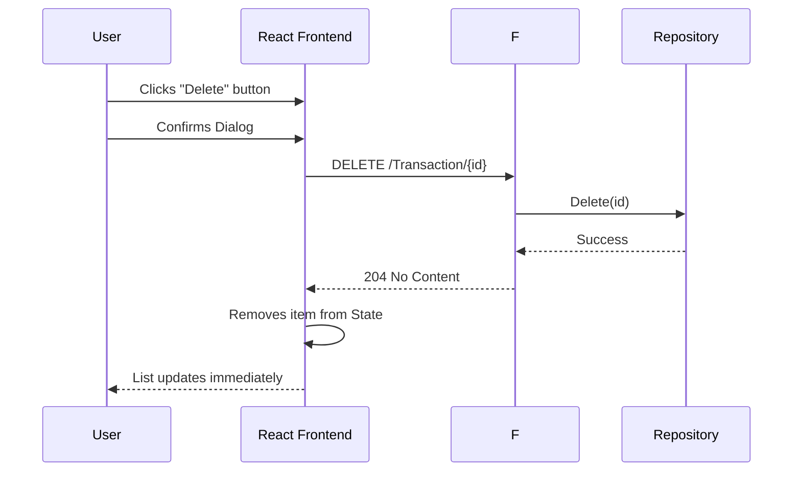

# System Workflow & Architecture

This document visualizes the architecture and data flow of the Personal Finance Tracker.

## 1. High-Level Architecture

This diagram shows how the User interacts with the Frontend, which communicates with the Backend API, eventually reaching the Data layer and External Services (Azure).

```mermaid
graph TD
    User((User))
    
    subgraph Frontend [React + Vite]
        UI[User Interface]
        ApiClient[API Client (api.ts)]
    end
    
    subgraph Backend [F# ASP.NET Core]
        Controller[TransactionController]
        DTO[DTO Layer]
        Domain[Domain Logic (Pure F#)]
        RepoInterface[ITransactionRepository]
        
        subgraph DataAccess
            InMemoryRepo[In-Memory Repository]
            PostgresRepo[PostgreSQL Repository]
        end
    end
    
    subgraph Infrastructure [Azure]
        DB[(PostgreSQL Database)]
        ServiceBus[Azure Service Bus]
    end

    User -->|Interacts| UI
    UI -->|Calls| ApiClient
    ApiClient -->|HTTP JSON| Controller
    
    Controller -->|Maps| DTO
    DTO -->|Converts to| Domain
    Controller -->|Uses| RepoInterface
    
    RepoInterface -->|Impl| InMemoryRepo
    RepoInterface -->|Impl| PostgresRepo
    
    PostgresRepo -->|SQL Query| DB
    Controller -.->|Publish Event| ServiceBus
```

## 2. "Add Transaction" Workflow

This sequence diagram details the step-by-step process when a user adds a new transaction.



## 3. "Delete Transaction" Workflow


